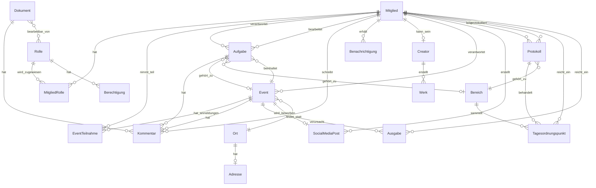

# Datenmodell

## Entity-Relationship-Diagramm



## Entitäten-Übersicht

### Hauptentitäten

1. **Mitglied** - Zentrale Nutzer-Entität
2. **Event** - Veranstaltungen des Vereins
3. **Rolle** - Berechtigungsrollen
4. **Aufgabe** - Tasks und Todos
5. **Creator** - Künstlerprofile
6. **Werk** - Kreative Arbeiten
7. **Kommentar** - Kommunikation
8. **Benachrichtigung** - System-Notifications
9. **Dokument** - Vereinsdokumente
10. **Ausgabe** - Finanzausgaben
11. **SocialMediaPost** - Social Media Inhalte
12. **Protokoll** - Sitzungsprotokolle
13. **Tagesordnungspunkt** - Agenda Items
14. **EventTeilnahme** - Event-Anmeldungen
15. **EmailVorlage** - E-Mail Templates
16. **Berechtigung** - Granulare Permissions
17. **MitgliedRolle** - Rollenzuweisungen
18. **Ort** - Locations
19. **Adresse** - Adressdaten

## Detaillierte Entitäten

### 1. Mitglied

**Beschreibung**: Zentrale Entität für alle Vereinsmitglieder

```typescript
interface Mitglied {
  // Identifikation
  id: string; // Frontend-generiert
  easyVereinId: string; // EasyVerein Integration

  // Stammdaten
  vorname: string;
  nachname: string;
  email: string;
  telefon?: string;

  // Status
  istAktiv: boolean;
  hatVertraulichkeitserklaerung: boolean;
  mitgliedSeit: Date;
  austrittsDatum?: Date;

  // Profildaten
  profilbild?: string;
  beschreibung?: string;
  skills?: string[];
  interessen?: string[];

  // Sichtbarkeit
  sichtbarkeitEmail: Sichtbarkeit;
  sichtbarkeitTelefon: Sichtbarkeit;
  sichtbarkeitProfil: Sichtbarkeit;

  // Metadaten
  erstelltAm: Date;
  aktualisiertAm: Date;
  letzterLogin?: Date;
}

enum Sichtbarkeit {
  OEFFENTLICH = "oeffentlich",
  INTERN = "intern",
  VORSTAND = "vorstand",
  PRIVAT = "privat",
}
```

### 2. Event

**Beschreibung**: Veranstaltungen des Vereins

```typescript
interface Event {
  // Identifikation
  id: string;

  // Basisdaten
  titel: string;
  beschreibung: string;
  kurzbeschreibung?: string; // Für öffentliche Ansicht

  // Zeit & Ort
  datum: Date;
  uhrzeit: string; // Format: "HH:MM"
  dauer?: number; // In Minuten
  ort: Ort;

  // Kategorisierung
  typ: EventTyp;
  sportbereich?: Sportbereich;
  tags?: string[];

  // Status & Sichtbarkeit
  status: EventStatus;
  istOeffentlich: boolean;
  istVertraulich: boolean;

  // Organisation
  verantwortlichId: string;
  stellvertreterIdList?: string[];

  // Finanzen
  budget?: number;
  budgetVerbraucht: number;

  // Teilnahme
  maxTeilnehmer?: number;
  minTeilnehmer?: number;
  anmeldeschluss?: Date;
  ticketLink?: string;
  teilnahmegebuehr?: number;

  // Metadaten
  erstelltAm: Date;
  erstelltVon: string;
  geaendertAm?: Date;
  geaendertVon?: string;
  genehmigtAm?: Date;
  genehmigtVon?: string;
  abgesagtAm?: Date;
  abgesagtVon?: string;
  abgesagtGrund?: string;
}

enum EventStatus {
  ENTWURF = "entwurf",
  GEPLANT = "geplant",
  GENEHMIGT = "genehmigt",
  AKTIV = "aktiv",
  ABGESCHLOSSEN = "abgeschlossen",
  ABGESAGT = "abgesagt",
}

enum EventTyp {
  VEREINSTREFFEN = "vereinstreffen",
  SPORTVERANSTALTUNG = "sportveranstaltung",
  FANFAHRT = "fanfahrt",
  SOCIAL = "social",
  SITZUNG = "sitzung",
  WORKSHOP = "workshop",
  TURNIER = "turnier",
  SONSTIGES = "sonstiges",
}

enum Sportbereich {
  LEAGUE_OF_LEGENDS = "league_of_legends",
  VALORANT = "valorant",
  FUSSBALL = "fussball",
  ESPORTS_ALLGEMEIN = "esports_allgemein",
  SONSTIGES = "sonstiges",
}
```

### 3. Rolle

**Beschreibung**: Berechtigungsrollen im System

```typescript
interface Rolle {
  id: string;
  name: RollenTyp;
  bezeichnung: string;
  beschreibung: string;
  hierarchieEbene: number; // 1 = höchste Ebene
  istSystemRolle: boolean; // Nicht löschbar
  farbe?: string; // Für UI
  icon?: string; // Für UI
}

enum RollenTyp {
  ADMIN = "admin",
  VORSTAND = "vorstand",
  BEIRAT = "beirat",
  KASSENPRUFER = "kassenprufer",
  TEAM_EVENT = "team_event",
  TEAM_TECHNIK = "team_technik",
  TEAM_MEDIEN = "team_medien",
  TEAM_VEREIN = "team_verein",
  MITGLIED = "mitglied",
}
```

### 4. Aufgabe

**Beschreibung**: Aufgaben im Kontext von Events oder Bereichen

```typescript
interface Aufgabe {
  id: string;
  titel: string;
  beschreibung?: string;

  // Zuordnung
  eventId?: string;
  bereichId?: string;
  uebergeordneteAufgabeId?: string; // Für Subtasks

  // Verantwortung
  verantwortlichId?: string;
  zugewiesenAn: string[]; // Mehrere Bearbeiter möglich

  // Status & Priorität
  status: AufgabeStatus;
  prioritaet: Prioritaet;
  fortschritt: number; // 0-100%

  // Zeitplanung
  frist?: Date;
  geschaetzterAufwand?: number; // In Stunden
  tatsaechlicherAufwand?: number; // In Stunden

  // Tracking
  erstelltAm: Date;
  erstelltVon: string;
  aktualisiertAm: Date;
  aktualisiertVon: string;
  erledigtAm?: Date;
  erledigtVon?: string;

  // Kategorisierung
  istStandardaufgabe: boolean;
  kategorie?: string;
  tags?: string[];

  // Checkliste
  checklistItems?: ChecklistItem[];

  // Wiederkehrend
  istWiederkehrend: boolean;
  wiederholungsregel?: string; // RRULE Format
}

interface ChecklistItem {
  id: string;
  text: string;
  istErledigt: boolean;
  erledigtVon?: string;
  erledigtAm?: Date;
}

enum AufgabeStatus {
  OFFEN = "offen",
  IN_BEARBEITUNG = "in_bearbeitung",
  REVIEW = "review",
  ERLEDIGT = "erledigt",
  ABGEBROCHEN = "abgebrochen",
  BLOCKIERT = "blockiert",
}

enum Prioritaet {
  NIEDRIG = "niedrig",
  MITTEL = "mittel",
  HOCH = "hoch",
  KRITISCH = "kritisch",
}
```

### 5. Creator

**Beschreibung**: Künstlerprofile für kreative Mitglieder

```typescript
interface Creator {
  id: string;
  mitgliedId: string;

  // Profildaten
  kuenstlername?: string;
  profiltext: string;
  portfolioLink?: string;
  profilbanner?: string;

  // Status
  istAktiv: boolean;
  istVerifiziert: boolean;
  aktivSeit: Date;
  deaktiviertAm?: Date;
  deaktiviertGrund?: string;

  // Social Media
  instagram?: string;
  twitter?: string;
  tiktok?: string;
  youtube?: string;
  twitch?: string;
  website?: string;

  // Kategorien
  kategorien: CreatorKategorie[];

  // Statistiken
  anzahlWerke: number;
  anzahlAufrufe: number;
  letzteAktivitaet: Date;
}

enum CreatorKategorie {
  GRAFIK_DESIGN = "grafik_design",
  FOTOGRAFIE = "fotografie",
  VIDEO = "video",
  MUSIK = "musik",
  SCHREIBEN = "schreiben",
  STREAMING = "streaming",
  SONSTIGES = "sonstiges",
}
```

### 6. Werk

**Beschreibung**: Kreative Arbeiten der Creator

```typescript
interface Werk {
  id: string;
  creatorId: string;

  // Grunddaten
  titel: string;
  beschreibung?: string;
  typ: WerkTyp;
  kategorien: string[];

  // Medien
  dateiUrl: string;
  thumbnailUrl?: string;
  dateigroesse: number; // In Bytes
  dateityp: string; // MIME Type

  // Metadaten
  erstelltAm: Date;
  hochgeladenAm: Date;
  veroeffentlichtAm?: Date;
  aktualisiertAm: Date;

  // Sichtbarkeit
  istOeffentlich: boolean;
  istGepinnt: boolean; // Featured
  reihenfolge: number;

  // Statistiken
  aufrufe: number;
  likes: number;

  // Lizenz
  lizenz?: string;
  quellenangabe?: string;
}

enum WerkTyp {
  BILD = "bild",
  VIDEO = "video",
  AUDIO = "audio",
  TEXT = "text",
  ANIMATION = "animation",
  DESIGN = "design",
}
```

### 7. Kommentar

**Beschreibung**: Kommentare zu verschiedenen Entitäten

```typescript
interface Kommentar {
  id: string;
  text: string;

  // Kontext (polymorphe Beziehung)
  kontextTyp: KommentarKontext;
  kontextId: string;

  // Hierarchie
  uebergeordneterKommentarId?: string; // Für Antworten

  // Autor
  autorId: string;
  erstelltAm: Date;
  bearbeitetAm?: Date;
  bearbeitetVon?: string;

  // Erwähnungen
  erwaehntePersonenIdList: string[];

  // Status
  istIntern: boolean;
  istGeloescht: boolean;
  geloeschtAm?: Date;
  geloeschtVon?: string;

  // Reaktionen
  reaktionen?: Reaktion[];
}

interface Reaktion {
  mitgliedId: string;
  typ: ReaktionTyp;
  erstelltAm: Date;
}

enum KommentarKontext {
  EVENT = "event",
  AUFGABE = "aufgabe",
  DOKUMENT = "dokument",
  PROTOKOLL = "protokoll",
  AUSGABE = "ausgabe",
}

enum ReaktionTyp {
  LIKE = "like",
  HERZ = "herz",
  DAUMEN_HOCH = "daumen_hoch",
  DAUMEN_RUNTER = "daumen_runter",
  LACHEN = "lachen",
  UEBERRASCHT = "ueberrascht",
}
```

### 8. Weitere Entitäten

```typescript
// Benachrichtigung
interface Benachrichtigung {
  id: string;
  empfaengerId: string;
  typ: BenachrichtigungTyp;
  titel: string;
  nachricht: string;
  kontextTyp?: string;
  kontextId?: string;
  gelesen: boolean;
  gelesenAm?: Date;
  versendetAm: Date;
  prioritaet: Prioritaet;
  aktionsUrl?: string;
}

// Dokument
interface Dokument {
  id: string;
  titel: string;
  typ: DokumentTyp;
  inhalt?: string; // Für Text-Dokumente
  dateiUrl?: string; // Für Uploads
  istOeffentlich: boolean;
  bearbeitbarVon: string[]; // Rollen-IDs
  version: number;
  versionKommentar?: string;
  erstelltAm: Date;
  erstelltVon: string;
  aktualisiertAm: Date;
  aktualisiertVon: string;
}

// Ausgabe
interface Ausgabe {
  id: string;
  eventId: string;
  beschreibung: string;
  betrag: number;
  kategorie: AusgabeKategorie;
  belegUrl?: string;
  rechnungsnummer?: string;
  lieferant?: string;
  status: AusgabeStatus;
  eingereichtVon: string;
  eingereichtAm: Date;
  genehmigtVon?: string;
  genehmigtAm?: Date;
  abgelehntVon?: string;
  abgelehntAm?: Date;
  ablehnungsgrund?: string;
  ausgezahltAm?: Date;
  zahlungsreferenz?: string;
}

// SocialMediaPost
interface SocialMediaPost {
  id: string;
  inhalt: string;
  plattformen: SocialMediaPlattform[];
  eventId?: string;
  postDatum?: Date;
  status: PostStatus;
  erstelltVon: string;
  erstelltAm: Date;
  approvedVon?: string;
  approvedAm?: Date;
  hashtags: string[];
  medienUrls: string[];
  linkUrl?: string;
  statistiken?: PostStatistiken;
}

// EventTeilnahme
interface EventTeilnahme {
  id: string;
  eventId: string;
  mitgliedId: string;
  angemeldetAm: Date;
  status: TeilnahmeStatus;
  kommentar?: string;
  istBestaetigt: boolean;
  bestaetigtAm?: Date;
  bestaetigtVon?: string;
  teilgenommenAm?: Date;
  feedbackGegeben: boolean;
}
```

## Datenmengen-Schätzung (pro Jahr)

| Entität              | Geschätzte Anzahl | Wachstumsrate | Speicherbedarf     |
| -------------------- | ----------------- | ------------- | ------------------ |
| **Mitglied**         | 100-200           | +20% p.a.     | ~1 MB/Mitglied     |
| **Event**            | 50-100            | +30% p.a.     | ~100 KB/Event      |
| **Aufgabe**          | 500-1000          | mit Events    | ~10 KB/Aufgabe     |
| **EventTeilnahme**   | 1000-2000         | mit Events    | ~1 KB/Teilnahme    |
| **Kommentar**        | 2000-5000         | +50% p.a.     | ~2 KB/Kommentar    |
| **Benachrichtigung** | 5000-10000        | mit Aktivität | ~1 KB/Notification |
| **Creator**          | 10-20             | +2-3 p.a.     | ~50 KB/Creator     |
| **Werk**             | 100-300           | mit Creators  | ~5 MB/Werk         |
| **SocialMediaPost**  | 100-200           | +20% p.a.     | ~50 KB/Post        |
| **Dokument**         | 20-50             | stabil        | ~500 KB/Dokument   |
| **Protokoll**        | 20-40             | stabil        | ~100 KB/Protokoll  |
| **Ausgabe**          | 200-400           | mit Events    | ~50 KB/Ausgabe     |

**Geschätzter Gesamtspeicherbedarf**:

- Jahr 1: ~500 MB
- Jahr 3: ~2 GB
- Jahr 5: ~5 GB

## Indizierung

### Primäre Indizes

- Alle `id` Felder (Unique)
- `mitglied.email` (Unique)
- `mitglied.easyVereinId` (Unique)
- `event.datum`
- `aufgabe.frist`

### Zusammengesetzte Indizes

- `event(status, datum)`
- `aufgabe(status, verantwortlichId)`
- `eventTeilnahme(eventId, mitgliedId)`
- `mitgliedRolle(mitgliedId, rolleId)`

### Volltext-Indizes

- `event.titel, event.beschreibung`
- `dokument.titel, dokument.inhalt`
- `kommentar.text`
