# Ablaufdiagramme

## 1. Event-Lifecycle

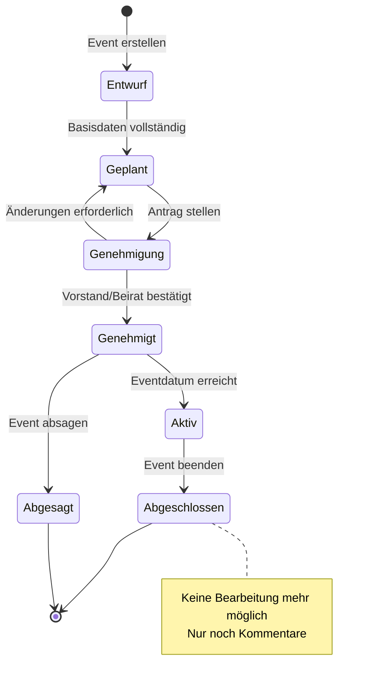

## 2. Event-Erstellung (Sequenzdiagramm)

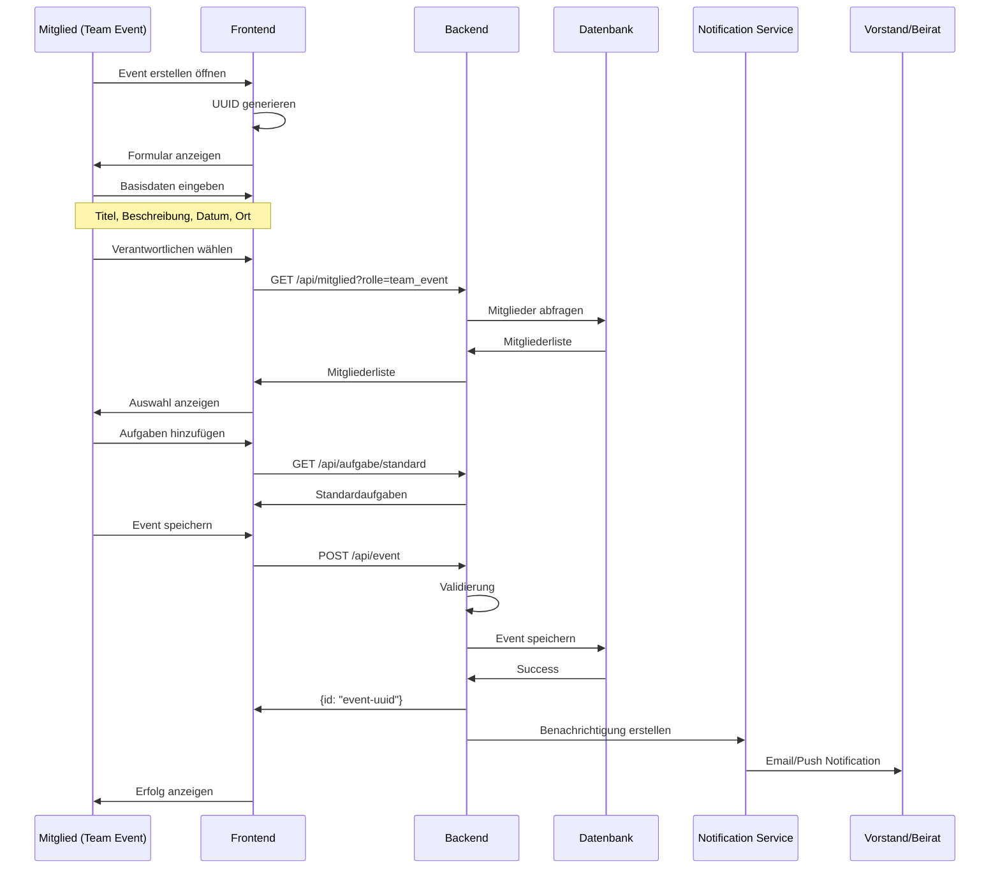

## 3. Event-Genehmigung

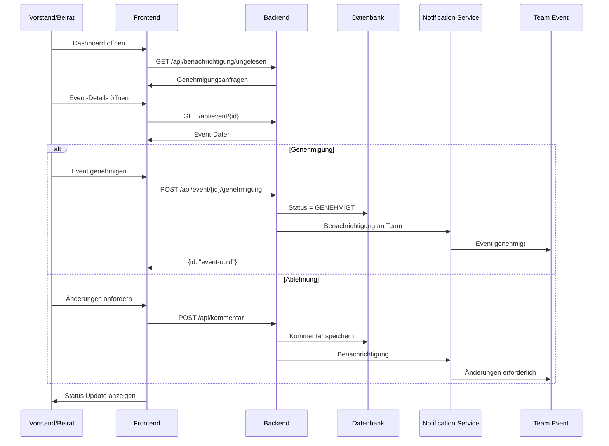

## 4. Event-Anmeldung

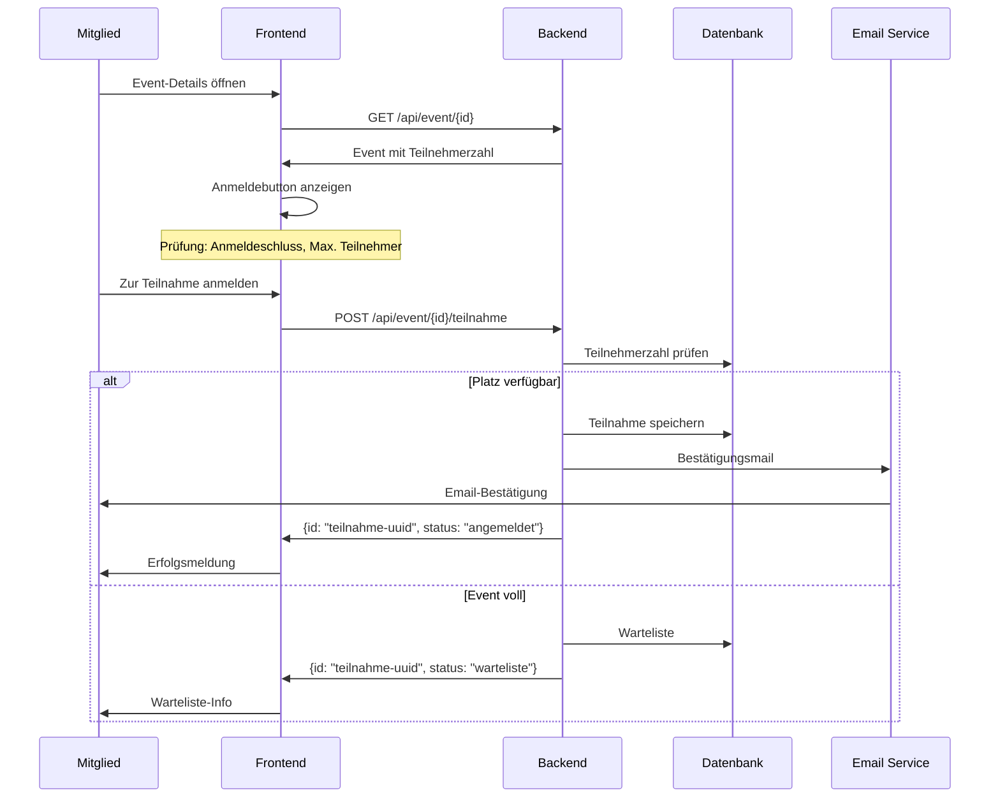

## 5. Creator-Workflow

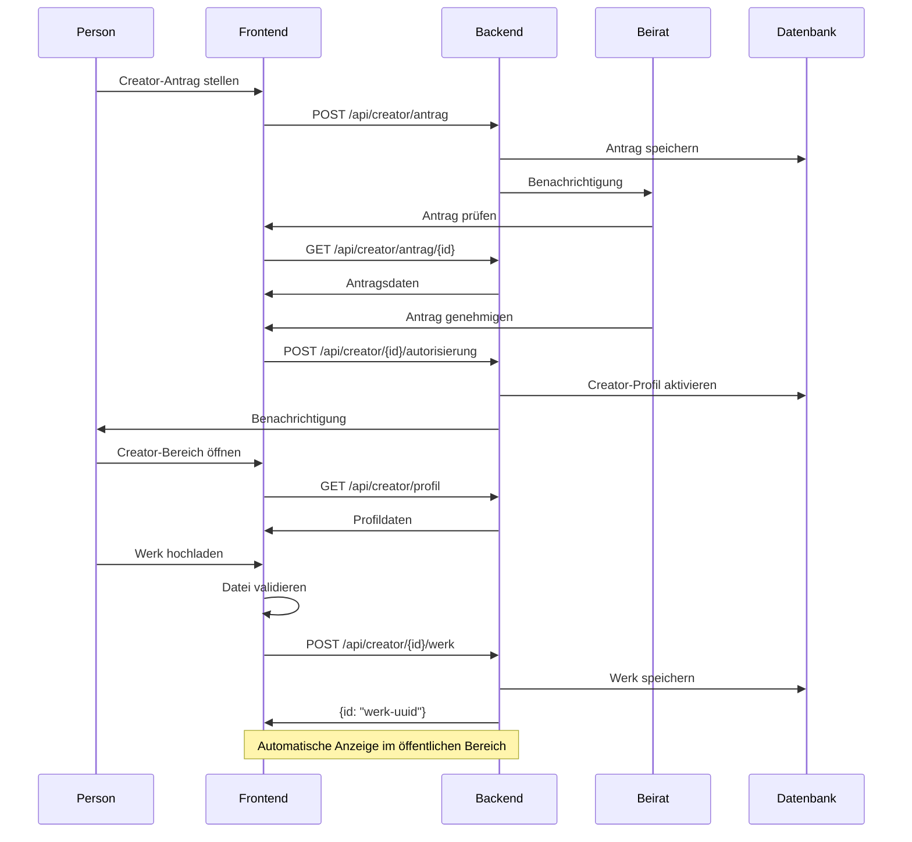

## 6. Aufgaben-Management

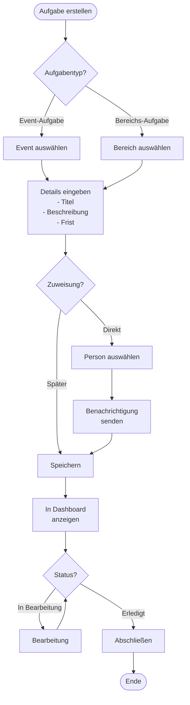

## 7. Social Media Post Workflow

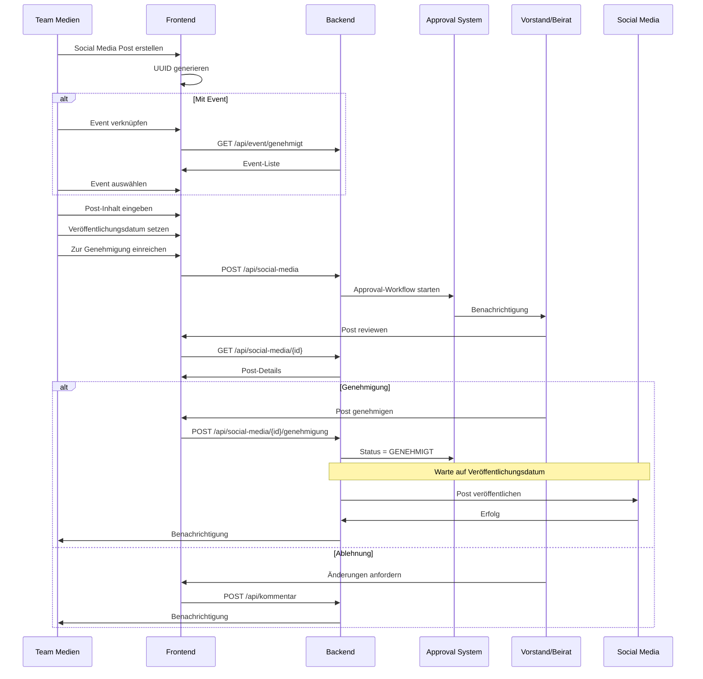

## 8. Login-Flow (EasyVerein OAuth)

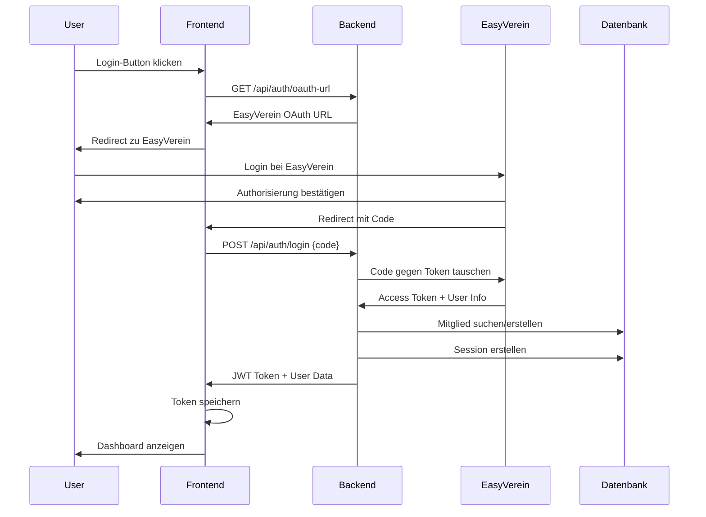

## 9. Finanzen-Workflow

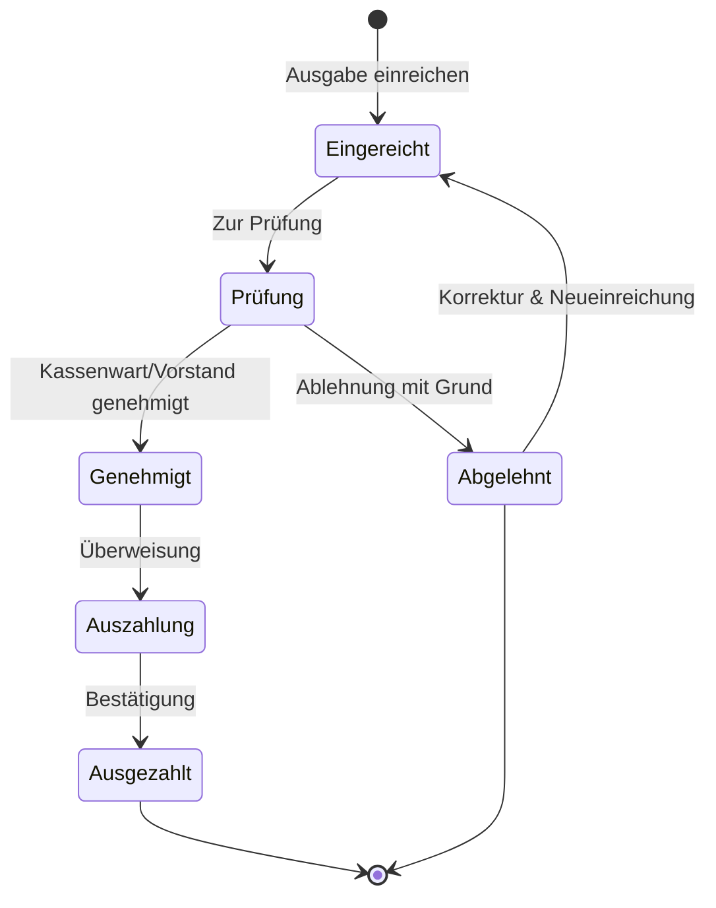

## 10. Notification-Flow

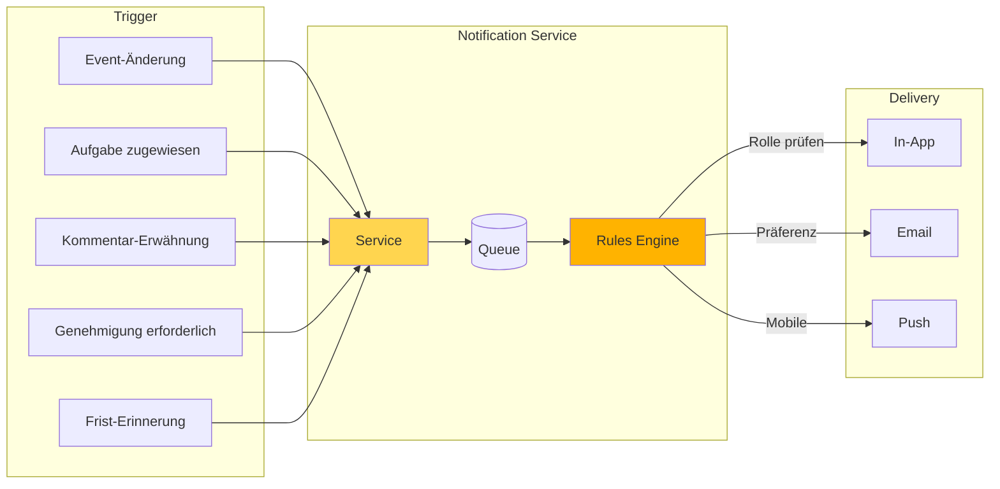

## 11. Datenfluss-Übersicht

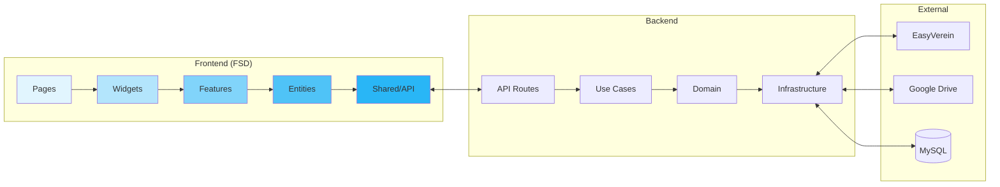

## 12. Event-Timeline Beispiel

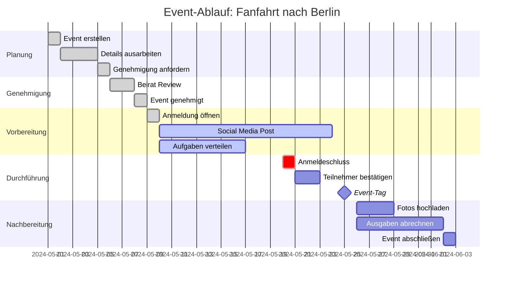
