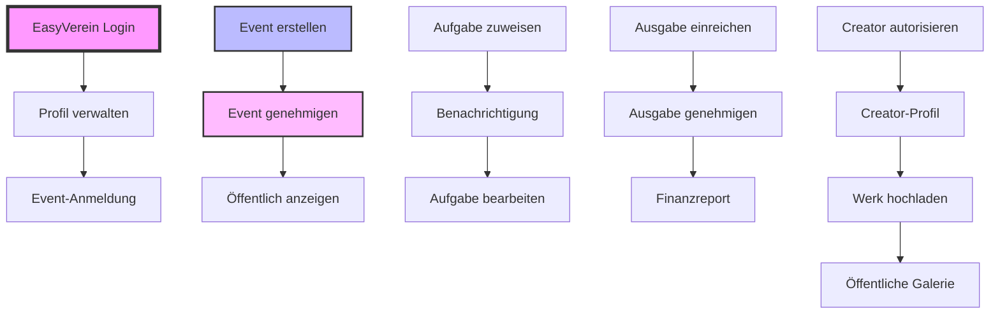
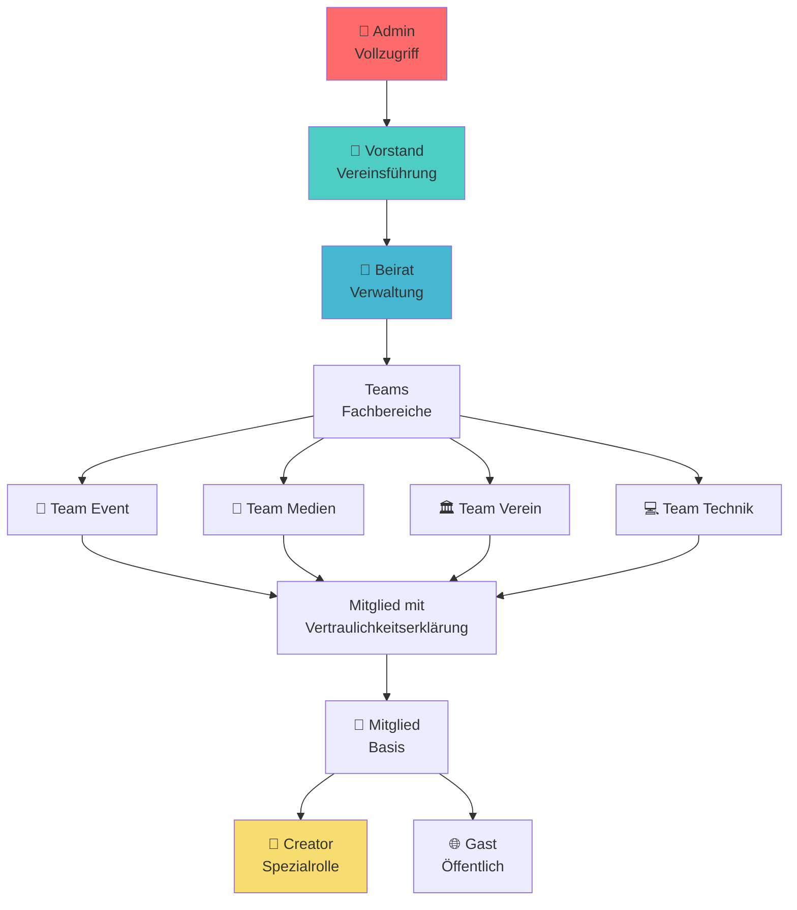

# Akteur-Use-Case-Matrix

## Übersicht: Akteure und ihre Hauptfunktionen

### 🌐 Gast (Öffentlicher Nutzer)

| Use-Case                    | Beschreibung                                        | Priorität |
| --------------------------- | --------------------------------------------------- | --------- |
| Events ansehen              | Öffentliche Events durchsuchen und Details einsehen | Hoch      |
| Dokumente lesen             | Satzung und öffentliche Dokumente einsehen          | Mittel    |
| Creator-Profile durchsuchen | Künstlerprofile und Werke ansehen                   | Mittel    |
| Kontaktformular nutzen      | Anfragen an den Verein senden                       | Hoch      |
| Newsletter abonnieren       | Für Updates registrieren                            | Mittel    |
| Mediengalerie ansehen       | Fotos und Videos durchsuchen                        | Niedrig   |
| Sportbereich erkunden       | Infos zu Sportteams einsehen                        | Niedrig   |

### 👥 Mitglied

| Use-Case                     | Beschreibung                          | Priorität |
| ---------------------------- | ------------------------------------- | --------- |
| Über EasyVerein anmelden     | OAuth-Login mit bestehenden Daten     | Kritisch  |
| Eigenes Profil verwalten     | Kontaktdaten und Sichtbarkeit pflegen | Kritisch  |
| Mitgliederliste einsehen     | Andere Mitglieder finden              | Hoch      |
| Zu Event anmelden            | Teilnahme an Veranstaltungen          | Kritisch  |
| Eigene Aufgaben verwalten    | Zugewiesene Aufgaben bearbeiten       | Hoch      |
| Kommentare schreiben         | Feedback und Diskussionen             | Mittel    |
| Benachrichtigungen empfangen | Updates zu relevanten Themen          | Hoch      |
| Dashboard nutzen             | Persönliche Übersicht                 | Hoch      |
| Ausgaben einreichen          | Belege für Erstattungen               | Mittel    |

### 🎯 Team Event

| Use-Case                 | Beschreibung                      | Priorität |
| ------------------------ | --------------------------------- | --------- |
| Event erstellen          | Neue Veranstaltung anlegen        | Kritisch  |
| Event bearbeiten         | Bestehende Events anpassen        | Kritisch  |
| Aufgaben zuweisen        | Tasks an Mitglieder verteilen     | Hoch      |
| Teilnehmer verwalten     | Anmeldungen bearbeiten            | Hoch      |
| Budget verwalten         | Finanzen pro Event überwachen     | Mittel    |
| Event-Status ändern      | Workflow durchführen              | Hoch      |
| Standardaufgaben pflegen | Vorlagen für wiederkehrende Tasks | Mittel    |
| Event-Serien erstellen   | Wiederkehrende Events             | Niedrig   |

### 📱 Team Medien

| Use-Case                    | Beschreibung                      | Priorität |
| --------------------------- | --------------------------------- | --------- |
| Social Media Post erstellen | Beiträge vorbereiten              | Hoch      |
| Creator verwalten           | Künstlerprofile administrieren    | Mittel    |
| Mediengalerie pflegen       | Fotos/Videos hochladen und ordnen | Mittel    |
| Newsletter verfassen        | Mitglieder-Updates erstellen      | Mittel    |
| Event-Werbung koordinieren  | Marketing für Events              | Hoch      |
| Content-Kalender pflegen    | Posting-Planung                   | Mittel    |
| Analytics einsehen          | Social Media Statistiken          | Niedrig   |

### 🏛️ Team Verein

| Use-Case                    | Beschreibung                  | Priorität |
| --------------------------- | ----------------------------- | --------- |
| E-Mail-Vorlagen verwalten   | Standardkommunikation pflegen | Niedrig   |
| Mitgliedsausweise erstellen | Dokumente generieren          | Niedrig   |
| Vereinskommunikation        | Interne Infos verteilen       | Mittel    |
| FAQ pflegen                 | Häufige Fragen beantworten    | Niedrig   |
| Mitgliederstatistiken       | Entwicklung analysieren       | Mittel    |
| Ehrungen verwalten          | Auszeichnungen dokumentieren  | Niedrig   |

### 💻 Team Technik

| Use-Case              | Beschreibung              | Priorität |
| --------------------- | ------------------------- | --------- |
| System überwachen     | Technische Funktionalität | Mittel    |
| Backups verwalten     | Datensicherung            | Hoch      |
| Benutzer-Support      | Technische Hilfe          | Mittel    |
| Integrationen pflegen | APIs und Schnittstellen   | Hoch      |
| Updates durchführen   | Software aktualisieren    | Hoch      |
| Logs analysieren      | Fehlerdiagnose            | Mittel    |

### 👔 Beirat

| Use-Case                  | Beschreibung                | Priorität |
| ------------------------- | --------------------------- | --------- |
| Events genehmigen         | Veranstaltungen freigeben   | Kritisch  |
| Ausgaben genehmigen       | Finanzen kontrollieren      | Hoch      |
| Mitglieder verwalten      | Stammdaten pflegen          | Hoch      |
| Rollen zuweisen           | Berechtigungen vergeben     | Kritisch  |
| Protokolle erstellen      | Sitzungen dokumentieren     | Mittel    |
| Creator autorisieren      | Künstler freischalten       | Mittel    |
| Vertraulichkeit verwalten | Sensitive Inhalte markieren | Hoch      |
| Tagesordnung erstellen    | Sitzungen vorbereiten       | Mittel    |

### 👑 Vorstand

| Use-Case                    | Beschreibung                | Priorität |
| --------------------------- | --------------------------- | --------- |
| Alle Beirat-Funktionen      | Erbt alle Beirat-Rechte     | -         |
| Dokumente bearbeiten        | Satzung und offizielle Docs | Hoch      |
| Finanzreport erstellen      | Übersicht generieren        | Mittel    |
| Budget überwachen           | Gesamtfinanzen im Blick     | Hoch      |
| Strategische Entscheidungen | Vereinsrichtung bestimmen   | Hoch      |
| Finale Event-Freigaben      | Letzte Instanz              | Hoch      |
| Jahresplanung               | Langfristige Ziele          | Mittel    |
| Externe Kommunikation       | Öffentlichkeitsarbeit       | Mittel    |

### 🎨 Creator

| Use-Case                 | Beschreibung              | Priorität |
| ------------------------ | ------------------------- | --------- |
| Creator-Profil verwalten | Künstlerdaten pflegen     | Hoch      |
| Werke hochladen          | Portfolio erweitern       | Hoch      |
| Social Media verknüpfen  | Externe Profile           | Mittel    |
| Statistiken einsehen     | Performance tracking      | Niedrig   |
| Event-Teilnahme          | Als Künstler auftreten    | Mittel    |
| Kollaborationen          | Mit anderen Creators      | Niedrig   |
| Lizenz verwalten         | Nutzungsrechte definieren | Mittel    |

### 🔧 Admin

| Use-Case                 | Beschreibung           | Priorität |
| ------------------------ | ---------------------- | --------- |
| Vollzugriff System       | Alle Funktionen        | Kritisch  |
| Technische Konfiguration | Systemeinstellungen    | Hoch      |
| Datenbank-Wartung        | Direkte DB-Zugriffe    | Mittel    |
| Notfall-Aktionen         | System-Recovery        | Hoch      |
| Audit-Logs einsehen      | Sicherheitsüberwachung | Hoch      |
| Performance-Tuning       | Optimierungen          | Mittel    |

## Use-Case-Abhängigkeiten

## Berechtigungsübersicht

| Funktion                 | Gast | Mitglied | Creator | Team Event | Team Medien | Team Verein | Team Technik | Beirat | Vorstand | Admin |
| ------------------------ | ---- | -------- | ------- | ---------- | ----------- | ----------- | ------------ | ------ | -------- | ----- |
| **Öffentliche Inhalte**  | ✅   | ✅       | ✅      | ✅         | ✅          | ✅          | ✅           | ✅     | ✅       | ✅    |
| **Login**                | ❌   | ✅       | ✅      | ✅         | ✅          | ✅          | ✅           | ✅     | ✅       | ✅    |
| **Profil (eigenes)**     | ❌   | ✅       | ✅      | ✅         | ✅          | ✅          | ✅           | ✅     | ✅       | ✅    |
| **Event-Anmeldung**      | ❌   | ✅       | ✅      | ✅         | ✅          | ✅          | ✅           | ✅     | ✅       | ✅    |
| **Event erstellen**      | ❌   | ❌       | ❌      | ✅         | ❌          | ❌          | ❌           | ✅     | ✅       | ✅    |
| **Event genehmigen**     | ❌   | ❌       | ❌      | ❌         | ❌          | ❌          | ❌           | ✅     | ✅       | ✅    |
| **Aufgaben zuweisen**    | ❌   | ❌       | ❌      | ✅         | ❌          | ❌          | ❌           | ✅     | ✅       | ✅    |
| **Social Media**         | ❌   | ❌       | ❌      | ❌         | ✅          | ❌          | ❌           | ✅     | ✅       | ✅    |
| **Creator-Funktionen**   | ❌   | ❌       | ✅      | ❌         | ❌          | ❌          | ❌           | ❌     | ❌       | ✅    |
| **Mitglieder verwalten** | ❌   | ❌       | ❌      | ❌         | ❌          | ✅          | ❌           | ✅     | ✅       | ✅    |
| **Dokumente bearbeiten** | ❌   | ❌       | ❌      | ❌         | ❌          | ❌          | ❌           | ❌     | ✅       | ✅    |
| **Finanzen genehmigen**  | ❌   | ❌       | ❌      | ❌         | ❌          | ❌          | ❌           | ✅     | ✅       | ✅    |
| **Technische Wartung**   | ❌   | ❌       | ❌      | ❌         | ❌          | ❌          | ✅           | ❌     | ❌       | ✅    |
| **System-Admin**         | ❌   | ❌       | ❌      | ❌         | ❌          | ❌          | ❌           | ❌     | ❌       | ✅    |

## Rollen-Hierarchie

## Use-Case Priorisierung nach Phasen

### Phase 1 (MVP) - Kritische Use-Cases

1. **Authentifizierung**: EasyVerein Login
2. **Profilverwaltung**: Basis-Funktionen
3. **Event-Grundfunktionen**: Erstellen, Anzeigen, Anmelden
4. **Rollensystem**: Basis-Berechtigungen
5. **Öffentliche Ansichten**: Events, Dokumente

### Phase 2 - Erweiterte Features

1. **Aufgabenverwaltung**: Zuweisung und Tracking
2. **Social Media**: Post-Erstellung und Genehmigung
3. **Creator-System**: Profile und Werke
4. **Benachrichtigungen**: E-Mail und In-App
5. **Erweiterte Event-Features**: Budget, Teilnehmerverwaltung

### Phase 3 - Vollständiges System

1. **Finanzverwaltung**: Ausgaben und Reports
2. **Protokollsystem**: Sitzungen und Beschlüsse
3. **Newsletter**: Erstellung und Versand
4. **Erweiterte Suche**: Volltext und Filter
5. **Analytics**: Statistiken und Reports

## Metriken für Use-Case Erfolg

| Use-Case             | Erfolgsmetrik                 | Zielwert     |
| -------------------- | ----------------------------- | ------------ |
| Event-Anmeldung      | Durchschnittliche Anmeldezeit | < 2 Minuten  |
| Aufgabe erstellen    | Erstellungszeit               | < 1 Minute   |
| Login                | Erfolgsrate                   | > 95%        |
| Event genehmigen     | Durchlaufzeit                 | < 48 Stunden |
| Profil aktualisieren | Abschlussrate                 | > 80%        |
| Social Media Post    | Genehmigungszeit              | < 24 Stunden |
