# Use-Case Diagramme

## 1. Gesamtübersicht Use-Cases

```mermaid
graph TB
    subgraph System["Faninitiative Webseite"]
        subgraph "Öffentlicher Bereich"
            UC_PUB_1[UC01: Events ansehen]
            UC_PUB_2[UC02: Dokumente einsehen]
            UC_PUB_3[UC03: Creator-Profile durchsuchen]
            UC_PUB_4[UC04: Kontaktformular nutzen]
            UC_PUB_5[UC05: Newsletter abonnieren]
            UC_PUB_6[UC06: Mediengalerie ansehen]
            UC_PUB_7[UC07: Sportbereich erkunden]
        end

        subgraph "Authentifizierung"
            UC_AUTH_1[UC10: Über EasyVerein anmelden]
            UC_AUTH_2[UC11: Abmelden]
            UC_AUTH_3[UC12: Session verwalten]
        end

        subgraph "Mitgliederbereich"
            UC_MEMBER_1[UC20: Eigenes Profil verwalten]
            UC_MEMBER_2[UC21: Mitgliederliste einsehen]
            UC_MEMBER_3[UC22: Zu Event anmelden]
            UC_MEMBER_4[UC23: Eigene Aufgaben verwalten]
            UC_MEMBER_5[UC24: Kommentare schreiben]
            UC_MEMBER_6[UC25: Benachrichtigungen empfangen]
            UC_MEMBER_7[UC26: Dashboard nutzen]
        end

        subgraph "Event-Management"
            UC_EVENT_1[UC30: Event erstellen]
            UC_EVENT_2[UC31: Event bearbeiten]
            UC_EVENT_3[UC32: Aufgaben zuweisen]
            UC_EVENT_4[UC33: Teilnehmer verwalten]
            UC_EVENT_5[UC34: Budget verwalten]
            UC_EVENT_6[UC35: Event Status ändern]
        end

        subgraph "Content-Management"
            UC_CONTENT_1[UC40: Social Media Post erstellen]
            UC_CONTENT_2[UC41: Creator-Profil verwalten]
            UC_CONTENT_3[UC42: Werke hochladen]
            UC_CONTENT_4[UC43: Mediengalerie pflegen]
            UC_CONTENT_5[UC44: Newsletter verfassen]
        end

        subgraph "Verwaltung"
            UC_ADMIN_1[UC50: Events genehmigen]
            UC_ADMIN_2[UC51: Ausgaben genehmigen]
            UC_ADMIN_3[UC52: Mitglieder verwalten]
            UC_ADMIN_4[UC53: Rollen zuweisen]
            UC_ADMIN_5[UC54: Dokumente bearbeiten]
            UC_ADMIN_6[UC55: Protokolle erstellen]
            UC_ADMIN_7[UC56: Creator autorisieren]
        end

        subgraph "Finanzen"
            UC_FIN_1[UC60: Ausgaben einreichen]
            UC_FIN_2[UC61: Finanzreport erstellen]
            UC_FIN_3[UC62: Budget überwachen]
        end
    end
```



## 2. Akteure und ihre primären Use-Cases

```mermaid
graph LR
    %% Akteure
    Gast[👤 Gast]
    Mitglied[👥 Mitglied]
    TeamEvent[🎯 Team Event]
    TeamMedien[📱 Team Medien]
    TeamVerein[🏛️ Team Verein]
    TeamTechnik[💻 Team Technik]
    Beirat[👔 Beirat]
    Vorstand[👑 Vorstand]
    Admin[🔧 Admin]
    Creator[🎨 Creator]

    %% Gast Use-Cases
    Gast --> UC_PUB_1
    Gast --> UC_PUB_2
    Gast --> UC_PUB_3
    Gast --> UC_PUB_4
    Gast --> UC_PUB_5
    Gast --> UC_PUB_6
    Gast --> UC_PUB_7

    %% Mitglied Use-Cases (erbt von Gast)
    Mitglied -.->|erbt| Gast
    Mitglied --> UC_AUTH_1
    Mitglied --> UC_MEMBER_1
    Mitglied --> UC_MEMBER_2
    Mitglied --> UC_MEMBER_3
    Mitglied --> UC_MEMBER_4
    Mitglied --> UC_MEMBER_5
    Mitglied --> UC_MEMBER_6
    Mitglied --> UC_MEMBER_7
    Mitglied --> UC_FIN_1

    %% Creator (spezielles Mitglied)
    Creator -.->|erbt| Mitglied
    Creator --> UC_CONTENT_2
    Creator --> UC_CONTENT_3

    %% Team Event
    TeamEvent -.->|erbt| Mitglied
    TeamEvent --> UC_EVENT_1
    TeamEvent --> UC_EVENT_2
    TeamEvent --> UC_EVENT_3
    TeamEvent --> UC_EVENT_4
    TeamEvent --> UC_EVENT_5

    %% Team Medien
    TeamMedien -.->|erbt| Mitglied
    TeamMedien --> UC_CONTENT_1
    TeamMedien --> UC_CONTENT_4
    TeamMedien --> UC_CONTENT_5

    %% Beirat
    Beirat -.->|erbt| Mitglied
    Beirat --> UC_ADMIN_1
    Beirat --> UC_ADMIN_2
    Beirat --> UC_ADMIN_3
    Beirat --> UC_ADMIN_4
    Beirat --> UC_ADMIN_6
    Beirat --> UC_ADMIN_7

    %% Vorstand
    Vorstand -.->|erbt| Beirat
    Vorstand --> UC_ADMIN_5
    Vorstand --> UC_FIN_2
    Vorstand --> UC_FIN_3
    Vorstand --> UC_EVENT_6
```



## 3. Detaillierte Use-Case: Event-Management

```mermaid
graph TB
    TeamEvent[Team Event]
    Mitglied[Mitglied]
    Beirat[Beirat]

    subgraph "Event-Management Detail"
        UC30[Event erstellen]
        UC30_1[Basisdaten eingeben]
        UC30_2[Ort festlegen]
        UC30_3[Budget definieren]
        UC30_4[Verantwortlichen bestimmen]

        UC31[Event bearbeiten]
        UC31_1[Status prüfen]
        UC31_2[Änderungen vornehmen]
        UC31_3[Genehmigung anfordern]

        UC32[Aufgaben zuweisen]
        UC32_1[Standardaufgaben laden]
        UC32_2[Neue Aufgabe erstellen]
        UC32_3[Person zuweisen]
        UC32_4[Frist setzen]

        UC33[Teilnehmer verwalten]
        UC33_1[Anmeldungen einsehen]
        UC33_2[Teilnehmer bestätigen]
        UC33_3[Warteliste verwalten]

        UC50[Event genehmigen]
        UC50_1[Details prüfen]
        UC50_2[Budget freigeben]
        UC50_3[Öffentlichkeit festlegen]
    end

    TeamEvent --> UC30
    UC30 ..> UC30_1 : include
    UC30 ..> UC30_2 : include
    UC30 ..> UC30_3 : extend
    UC30 ..> UC30_4 : include

    TeamEvent --> UC31
    UC31 ..> UC31_1 : include
    UC31 ..> UC31_2 : include
    UC31 ..> UC31_3 : extend

    TeamEvent --> UC32
    UC32 ..> UC32_1 : extend
    UC32 ..> UC32_2 : extend
    UC32 ..> UC32_3 : include
    UC32 ..> UC32_4 : extend

    TeamEvent --> UC33
    UC33 ..> UC33_1 : include
    UC33 ..> UC33_2 : include
    UC33 ..> UC33_3 : extend

    Beirat --> UC50
    UC50 ..> UC50_1 : include
    UC50 ..> UC50_2 : extend
    UC50 ..> UC50_3 : include

    Mitglied --> UC33_1
```

## 4. Detaillierte Use-Case: Mitgliederverwaltung

```mermaid
graph TB
    Mitglied[Mitglied]
    Beirat[Beirat]
    Vorstand[Vorstand]
    System[System]

    subgraph "Mitgliederverwaltung Detail"
        UC20[Eigenes Profil verwalten]
        UC20_1[Kontaktdaten ändern]
        UC20_2[Profilbild hochladen]
        UC20_3[Sichtbarkeit einstellen]
        UC20_4[Beschreibung pflegen]

        UC52[Mitglieder verwalten]
        UC52_1[Mitgliederliste filtern]
        UC52_2[Mitglied aktivieren/deaktivieren]
        UC52_3[Vertraulichkeitserklärung vermerken]

        UC53[Rollen zuweisen]
        UC53_1[Verfügbare Rollen anzeigen]
        UC53_2[Rolle zuweisen]
        UC53_3[Rolle entziehen]
        UC53_4[Benachrichtigung senden]

        UC_AUTH[EasyVerein Integration]
        UC_AUTH_1[OAuth initiieren]
        UC_AUTH_2[Mitgliedsdaten synchronisieren]
    end

    Mitglied --> UC20
    UC20 ..> UC20_1 : extend
    UC20 ..> UC20_2 : extend
    UC20 ..> UC20_3 : include
    UC20 ..> UC20_4 : extend

    Beirat --> UC52
    UC52 ..> UC52_1 : include
    UC52 ..> UC52_2 : include
    UC52 ..> UC52_3 : extend

    Beirat --> UC53
    Vorstand --> UC53
    UC53 ..> UC53_1 : include
    UC53 ..> UC53_2 : include
    UC53 ..> UC53_3 : extend
    UC53 ..> UC53_4 : include

    System --> UC_AUTH
    UC_AUTH ..> UC_AUTH_1 : include
    UC_AUTH ..> UC_AUTH_2 : include

    UC52 -.-> UC_AUTH : uses
```

## 5. Detaillierte Use-Case: Content & Creator

```mermaid
graph TB
    Creator[Creator]
    TeamMedien[Team Medien]
    Beirat[Beirat]
    Gast[Gast]

    subgraph "Content Management Detail"
        UC41[Creator-Profil verwalten]
        UC41_1[Künstlernamen setzen]
        UC41_2[Portfolio-Link hinzufügen]
        UC41_3[Social Media verknüpfen]

        UC42[Werke hochladen]
        UC42_1[Datei validieren]
        UC42_2[Thumbnail generieren]
        UC42_3[Metadaten eingeben]
        UC42_4[Reihenfolge festlegen]

        UC40[Social Media Post]
        UC40_1[Inhalt erstellen]
        UC40_2[Event verknüpfen]
        UC40_3[Datum planen]
        UC40_4[Genehmigung anfordern]

        UC56[Creator autorisieren]
        UC56_1[Antrag prüfen]
        UC56_2[Profil aktivieren]

        UC03[Creator durchsuchen]
        UC03_1[Nach Kategorie filtern]
        UC03_2[Werke ansehen]
    end

    Creator --> UC41
    UC41 ..> UC41_1 : extend
    UC41 ..> UC41_2 : extend
    UC41 ..> UC41_3 : extend

    Creator --> UC42
    UC42 ..> UC42_1 : include
    UC42 ..> UC42_2 : include
    UC42 ..> UC42_3 : include
    UC42 ..> UC42_4 : extend

    TeamMedien --> UC40
    UC40 ..> UC40_1 : include
    UC40 ..> UC40_2 : extend
    UC40 ..> UC40_3 : include
    UC40 ..> UC40_4 : include

    Beirat --> UC56
    UC56 ..> UC56_1 : include
    UC56 ..> UC56_2 : include

    Gast --> UC03
    UC03 ..> UC03_1 : extend
    UC03 ..> UC03_2 : include
```

## 6. Detaillierte Use-Case: Finanzen & Protokolle

```mermaid
graph TB
    Mitglied[Mitglied]
    Vorstand[Vorstand]
    Kassenwart[Kassenwart]
    TeamEvent[Team Event]

    subgraph "Finanzverwaltung Detail"
        UC60[Ausgaben einreichen]
        UC60_1[Beleg hochladen]
        UC60_2[Kategorie wählen]
        UC60_3[Event zuordnen]

        UC51[Ausgaben genehmigen]
        UC51_1[Beleg prüfen]
        UC51_2[Budget kontrollieren]
        UC51_3[Genehmigung erteilen]
        UC51_4[Ablehnung begründen]

        UC62[Budget überwachen]
        UC62_1[Ausgaben aggregieren]
        UC62_2[Restbudget berechnen]
        UC62_3[Warnung bei Überschreitung]

        UC55[Protokoll erstellen]
        UC55_1[Teilnehmer erfassen]
        UC55_2[Tagesordnung abarbeiten]
        UC55_3[Beschlüsse dokumentieren]
        UC55_4[Protokoll genehmigen]
    end

    Mitglied --> UC60
    UC60 ..> UC60_1 : include
    UC60 ..> UC60_2 : include
    UC60 ..> UC60_3 : include

    Kassenwart --> UC51
    Vorstand --> UC51
    UC51 ..> UC51_1 : include
    UC51 ..> UC51_2 : include
    UC51 --> UC51_3 : extend
    UC51 --> UC51_4 : extend

    TeamEvent --> UC62
    Vorstand --> UC62
    UC62 ..> UC62_1 : include
    UC62 ..> UC62_2 : include
    UC62 ..> UC62_3 : extend

    Vorstand --> UC55
    UC55 ..> UC55_1 : include
    UC55 ..> UC55_2 : include
    UC55 ..> UC55_3 : include
    UC55 ..> UC55_4 : extend
```

## 7. System-Use-Cases

```mermaid
graph TB
    System[System]
    Timer[Timer Service]

    subgraph "Automatisierte Prozesse"
        UC_SYS_1[Benachrichtigungen versenden]
        UC_SYS_2[Fristen überwachen]
        UC_SYS_3[Status aktualisieren]
        UC_SYS_4[Daten synchronisieren]
        UC_SYS_5[Social Media posten]
        UC_SYS_6[Backups erstellen]

        UC_SYS_1_1[Email versenden]
        UC_SYS_1_2[Push Notification]
        UC_SYS_1_3[In-App Alert]

        UC_SYS_2_1[Aufgaben-Fristen prüfen]
        UC_SYS_2_2[Event-Anmeldeschluss]
        UC_SYS_2_3[Erinnerungen generieren]
    end

    System --> UC_SYS_1
    UC_SYS_1 ..> UC_SYS_1_1 : extend
    UC_SYS_1 ..> UC_SYS_1_2 : extend
    UC_SYS_1 ..> UC_SYS_1_3 : include

    Timer --> UC_SYS_2
    UC_SYS_2 ..> UC_SYS_2_1 : include
    UC_SYS_2 ..> UC_SYS_2_2 : include
    UC_SYS_2 ..> UC_SYS_2_3 : include

    Timer --> UC_SYS_3
    System --> UC_SYS_4
    Timer --> UC_SYS_5
    Timer --> UC_SYS_6
```

## Use-Case Prioritäten

### Kritisch (MVP - Phase 1)

- UC10: Über EasyVerein anmelden
- UC20: Eigenes Profil verwalten
- UC30: Event erstellen
- UC50: Events genehmigen
- UC22: Zu Event anmelden
- UC01: Events ansehen (öffentlich)

### Hoch (Phase 2)

- UC32: Aufgaben zuweisen
- UC40: Social Media Post erstellen
- UC41: Creator-Profil verwalten
- UC60: Ausgaben einreichen
- UC25: Benachrichtigungen empfangen

### Mittel (Phase 3)

- UC42: Werke hochladen
- UC55: Protokoll erstellen
- UC61: Finanzreport erstellen
- UC44: Newsletter verfassen
- UC06: Mediengalerie ansehen

### Niedrig (Zukünftig)

- UC62: Budget überwachen (automatisiert)
- UC07: Sportbereich erkunden
- Erweiterte Reporting-Features
- Mobile App spezifische Use-Cases
