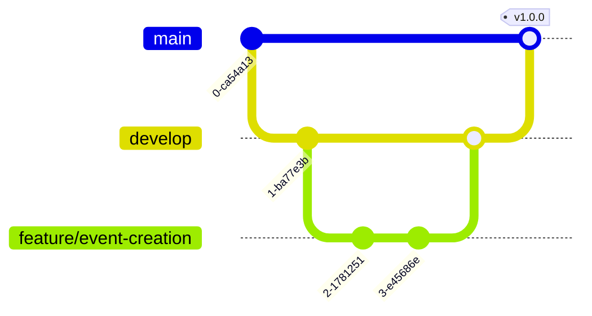

# Git Workflow

## Branch-Strategie

### Haupt-Branches



#### main (Production)

- Produktiver Code
- Nur über Pull Requests von `develop`
- Automatisches Deployment
- Protected Branch (keine direkten Commits)

#### develop (Integration)

- Aktuelle Entwicklung
- Integration aller Features
- Deployment auf Staging
- Basis für Feature-Branches

### Feature-Branches

#### Naming Convention

```
feature/{ticket-nummer}-{kurze-beschreibung}
fix/{ticket-nummer}-{kurze-beschreibung}
docs/{bereich}-{beschreibung}
chore/{aufgabe}
hotfix/{ticket-nummer}-{beschreibung}
```

#### Beispiele

```
feature/42-event-creation
fix/89-login-timeout
docs/api-endpoints-update
chore/update-dependencies
hotfix/101-critical-auth-bug
```

## Workflow

### 1. Feature entwickeln

```bash
# Develop auschecken und aktualisieren
git checkout develop
git pull origin develop

# Feature-Branch erstellen
git checkout -b feature/42-event-creation

# Entwickeln...
# Commits machen (siehe Commit-Konventionen)

# Regelmäßig mit develop synchronisieren
git fetch origin
git rebase origin/develop
```

### 2. Pull Request erstellen

#### PR Template

```markdown
## Beschreibung

Kurze Beschreibung der Änderungen

## Ticket

Closes #42

## Art der Änderung

- [ ] Bugfix
- [ ] Neues Feature
- [ ] Breaking Change
- [ ] Dokumentation

## Checkliste

- [ ] Code folgt den Coding Standards
- [ ] Tests geschrieben/angepasst
- [ ] Dokumentation aktualisiert
- [ ] Keine Konflikte mit develop
- [ ] Lokal getestet

## Screenshots (falls UI-Änderungen)

[Screenshots hier]

## Testing

Wie kann das Feature getestet werden?
```

### 3. Code Review

#### Review-Checkliste

- [ ] Code-Qualität und Standards
- [ ] Business Logic korrekt
- [ ] Performance-Aspekte
- [ ] Security-Überlegungen
- [ ] Test-Coverage
- [ ] Dokumentation

#### Review-Kommentare

```markdown
# Vorschlag

suggestion: Hier könnte `useMemo` die Performance verbessern

# Frage

question: Warum wird hier nicht die bestehende Utility-Funktion genutzt?

# Issue (muss behoben werden)

issue: Fehlende Error-Behandlung

# Nitpick (optional)

nitpick: Typo in Kommentar
```

### 4. Merge-Strategie

#### Feature → Develop

- **Squash and Merge** für saubere Historie
- Alle Commits werden zu einem zusammengefasst
- Commit-Message aus PR-Titel

#### Develop → Main

- **Create a Merge Commit**
- Beibehaltung der kompletten Historie
- Tag mit Versionsnummer

## Commit-Konventionen

### Format

```
type(scope): Beschreibung

[Optionaler Body]

[Optionaler Footer]
```

### Types

| Type     | Beschreibung     | Beispiel                                         |
| -------- | ---------------- | ------------------------------------------------ |
| feat     | Neues Feature    | `feat(event): Event-Erstellung hinzugefügt`      |
| fix      | Bugfix           | `fix(auth): Token-Refresh korrigiert`            |
| docs     | Dokumentation    | `docs(readme): Installation aktualisiert`        |
| style    | Formatierung     | `style(global): Einrückung korrigiert`           |
| refactor | Code-Refactoring | `refactor(api): Service-Layer extrahiert`        |
| test     | Tests            | `test(event): Integrationstests ergänzt`         |
| chore    | Wartung          | `chore(deps): Dependencies aktualisiert`         |
| perf     | Performance      | `perf(list): Virtuelles Scrolling implementiert` |
| ci       | CI/CD            | `ci(github): Build-Pipeline optimiert`           |

### Scope

- Bereich der Änderung
- Z.B.: `auth`, `event`, `member`, `api`, `ui`

### Beispiele

#### Einfacher Commit

```
feat(event): Event-Formular Validierung hinzugefügt
```

#### Ausführlicher Commit

```
fix(auth): Session-Timeout bei Tab-Wechsel behoben

Das Problem trat auf, wenn Nutzer zwischen Browser-Tabs wechselten
und die Session im Hintergrund ablief. Die Lösung nutzt jetzt
Page Visibility API um aktive Sessions zu erkennen.

Closes #89
```

#### Breaking Change

```
feat(api)!: Event-Endpoint Response-Format geändert

BREAKING CHANGE: Die Event-API gibt jetzt Daten im neuen
Format zurück. Clients müssen angepasst werden.

Migration:
- `event.title` → `event.titel`
- `event.date` → `event.datum`
```

## Versionierung

### Semantic Versioning

```
MAJOR.MINOR.PATCH
```

- **MAJOR**: Breaking Changes
- **MINOR**: Neue Features (backward compatible)
- **PATCH**: Bugfixes

### Release-Prozess

```bash
# 1. Release-Branch von develop
git checkout -b release/1.2.0 develop

# 2. Version bumpen
npm version minor

# 3. Changelog aktualisieren
# CHANGELOG.md bearbeiten

# 4. Release-Branch mergen
git checkout main
git merge --no-ff release/1.2.0
git tag -a v1.2.0 -m "Release version 1.2.0"

# 5. Zurück zu develop mergen
git checkout develop
git merge --no-ff release/1.2.0

# 6. Tags pushen
git push origin main develop --tags
```

## Hotfix-Prozess

```bash
# 1. Hotfix von main
git checkout -b hotfix/101-critical-bug main

# 2. Fix implementieren
# ...

# 3. Version patchen
npm version patch

# 4. Zu main mergen
git checkout main
git merge --no-ff hotfix/101-critical-bug
git tag -a v1.2.1 -m "Hotfix version 1.2.1"

# 5. Zu develop mergen
git checkout develop
git merge --no-ff hotfix/101-critical-bug

# 6. Pushen
git push origin main develop --tags
```

## Git Hooks (Husky)

### pre-commit

```bash
#!/bin/sh
# .husky/pre-commit

# Linting
npm run lint:staged

# Type-Check
npm run type-check

# Tests
npm run test:staged
```

### commit-msg

```bash
#!/bin/sh
# .husky/commit-msg

# Commit-Message validieren
npx commitlint --edit $1
```

### pre-push

```bash
#!/bin/sh
# .husky/pre-push

# Alle Tests ausführen
npm run test

# Build prüfen
npm run build
```

## Tipps & Best Practices

### 1. Kleine, atomare Commits

```bash
# ✅ Gut
git add src/features/event/EventForm.tsx
git commit -m "feat(event): Formular-Komponente erstellt"

git add src/features/event/validation.ts
git commit -m "feat(event): Validierungsregeln hinzugefügt"

# ❌ Schlecht
git add .
git commit -m "Event-Feature fertig"
```

### 2. Interactive Rebase für saubere Historie

```bash
# Letzte 3 Commits aufräumen
git rebase -i HEAD~3

# Im Editor:
pick abc1234 feat: Start Feature
squash def5678 WIP: Zwischenstand
squash ghi9012 feat: Feature fertig
```

### 3. Stash für Kontextwechsel

```bash
# Arbeit zwischenspeichern
git stash save "WIP: Event-Formular"

# Branch wechseln für Hotfix
git checkout main

# Später zurück
git checkout feature/event-form
git stash pop
```

### 4. Aliases für Effizienz

```bash
# ~/.gitconfig
[alias]
    co = checkout
    br = branch
    ci = commit
    st = status
    lg = log --oneline --graph --decorate
    undo = reset HEAD~1 --mixed
```

## Konfliktlösung

### Merge-Konflikte

```bash
# 1. Develop mergen
git merge origin/develop

# 2. Konflikte lösen
# Dateien bearbeiten, Konfliktmarker entfernen

# 3. Als gelöst markieren
git add .
git commit -m "merge: Konflikte mit develop gelöst"
```

### Rebase-Konflikte

```bash
# 1. Rebase starten
git rebase origin/develop

# 2. Konflikt lösen
# Datei bearbeiten

# 3. Fortfahren
git add .
git rebase --continue

# Bei Problemen abbrechen
git rebase --abort
```

## CI/CD Integration

### GitHub Actions

```yaml
name: CI

on:
  pull_request:
    branches: [develop, main]

jobs:
  test:
    runs-on: ubuntu-latest
    steps:
      - uses: actions/checkout@v3
      - uses: actions/setup-node@v3
      - run: npm ci
      - run: npm run lint
      - run: npm run type-check
      - run: npm run test
      - run: npm run build
```

## Notfall-Kommandos

```bash
# Letzten Commit rückgängig (behält Änderungen)
git reset HEAD~1

# Letzten Commit komplett verwerfen
git reset --hard HEAD~1

# Zu spezifischem Commit zurück
git reset --hard abc1234

# Einzelne Datei auf Stand von develop
git checkout origin/develop -- path/to/file

# Lokale Änderungen verwerfen
git checkout -- .

# Remote-Stand erzwingen (VORSICHT!)
git fetch origin
git reset --hard origin/develop
```
